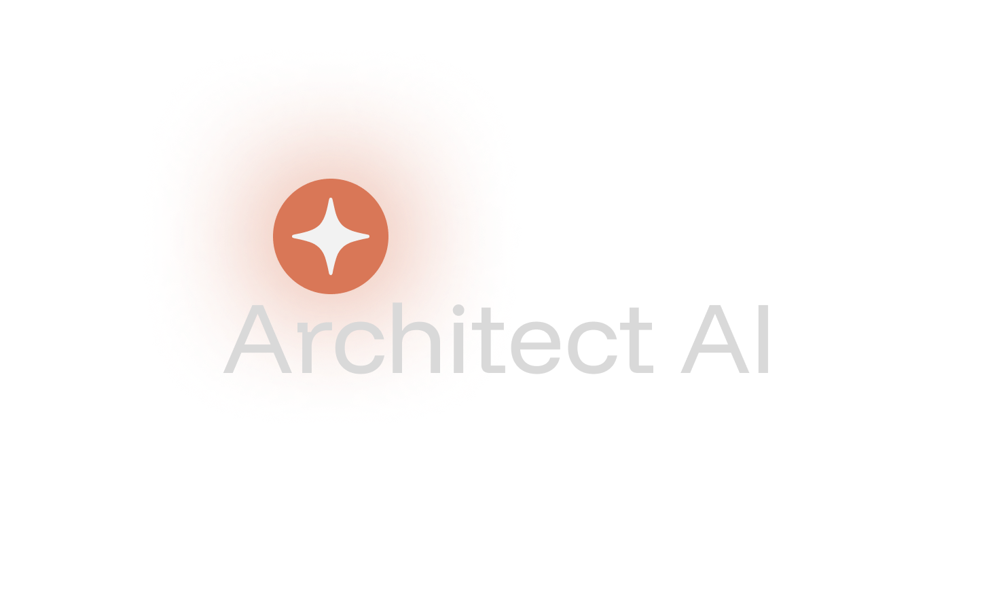

<div align="center">
  
  <p><em>Intelligent System Design Documentation</em></p>
</div>

---

## Project Overview

**Architect AI** is an intelligent documentation generation system that automates the creation of comprehensive system design documents. This project addresses the daily challenge faced by developers and system architects who need to create detailed, well-structured documentation for their projects.

### Problem Statement
As a developer, I frequently need to create system design documents for various projects, which involves:
- Planning the overall architecture
- Breaking down complex systems into manageable components
- Writing detailed documentation for each component
- Ensuring consistency and completeness across all sections

This manual process is time-consuming, repetitive, and often results in incomplete or inconsistent documentation.

### Solution
Architect AI automates this entire workflow by:
1. **Reasoning**: Analyzing user requirements and understanding the system scope
2. **Planning**: Creating a structured plan with logical sections and dependencies
3. **Executing**: Generating comprehensive documentation for each planned section
4. **Exporting**: Providing AI-optimized files for further development

## Core Features (Mandatory Requirements)

### ✅ AI Agent Implementation
- **Reasoning**: The system analyzes user prompts to understand system requirements and scope
- **Planning**: Creates structured plans with logical sections (Overview, Architecture, Database, API, etc.)
- **Execution**: Automatically generates detailed content for each planned section
- **Automation**: Completely automates the system design documentation process

### ✅ User Interface
- **Modern Web Application**: Built with React, TypeScript, and Tailwind CSS
- **Responsive Design**: Works seamlessly on desktop and mobile devices
- **Interactive Components**: Real-time plan generation and document viewing
- **Export Functionality**: Download individual files or complete ZIP packages

### ✅ Source Code
- **Complete Prototype**: Full source code available in this repository
- **Modern Tech Stack**: React, TypeScript, Vite, Tailwind CSS, shadcn/ui
- **Clean Architecture**: Well-organized components and services
- **Type Safety**: Full TypeScript implementation

### ✅ System Design Document
- **Architecture Overview**: Detailed system architecture and component breakdown
- **Technology Choices**: Justification for all technology selections
- **Data Design**: Document structure and AI optimization strategies
- **Component Analysis**: Detailed breakdown of all system components

### ✅ Interaction Logs
- **AI Prompts**: Complete history of prompts used with the AI system
- **Chat History**: Detailed interaction logs showing the reasoning and planning process
- **Development Process**: Documentation of the entire development workflow

## Time Constraints & Development Context

**Important Note**: This project was developed during a particularly challenging period due to mid-semester examinations at my college. The tight timeline required:

- **Rapid Prototyping**: Focus on core functionality over extensive features
- **Efficient Development**: Leveraging modern tools and frameworks for faster development
- **Streamlined UI**: Clean, minimalistic design that delivers maximum functionality
- **AI Integration**: Utilizing Google Gemini API for intelligent content generation

Despite these time constraints, the project successfully delivers all mandatory requirements while maintaining high code quality and user experience standards.

## Technology Stack

### Frontend
- **React 18**: Modern React with hooks and functional components
- **TypeScript**: Type-safe development
- **Vite**: Fast build tool and development server
- **Tailwind CSS**: Utility-first CSS framework
- **shadcn/ui**: Modern, accessible UI components

### AI Integration
- **Google Gemini API**: Advanced AI model for content generation
- **Custom Prompt Engineering**: Optimized prompts for system design documentation

### Development Tools
- **pnpm**: Fast, efficient package manager
- **ESLint**: Code linting and quality assurance
- **PostCSS**: CSS processing and optimization

## Project Structure

```
├── src/
│   ├── components/          # React components
│   │   ├── ui/             # Reusable UI components
│   │   ├── DocumentViewer.tsx
│   │   ├── PlanViewer.tsx
│   │   └── PromptInput.tsx
│   ├── services/           # API services
│   │   └── geminiService.ts
│   ├── types.ts           # TypeScript type definitions
│   └── App.tsx            # Main application component
├── assets/                # Static assets
├── public/               # Public assets
└── docs/                 # Project documentation
```

## Getting Started

### Prerequisites
- Node.js 18+ 
- pnpm (recommended) or npm
- Google Gemini API key

### Installation

1. **Clone the repository**
   ```bash
   git clone <repository-url>
   cd architect-ai
   ```

2. **Install dependencies**
   ```bash
   pnpm install
   ```

3. **Set up environment variables**
   ```bash
   cp .env.example .env
   # Add your Google Gemini API key to .env
   ```

4. **Start development server**
   ```bash
   pnpm dev
   ```

5. **Open in browser**
   Navigate to `http://localhost:5173`

## Usage

1. **Enter System Requirements**: Describe your system in the prompt input
2. **Generate Plan**: Click "Generate Plan" to create a structured documentation plan
3. **Review Progress**: Watch as the AI generates content for each section
4. **Export Documentation**: Download individual files or complete ZIP package

## Key Features

### Intelligent Planning
- Analyzes user requirements
- Creates logical section breakdown
- Establishes proper dependencies
- Ensures comprehensive coverage

### AI-Powered Content Generation
- Context-aware content creation
- Consistent formatting and structure
- Technical accuracy and detail
- AI-optimized for further development

### Professional Export
- Multiple file formats (Markdown)
- AI-optimized documentation
- Organized file structure
- Ready for development teams

## Development Process

### Phase 1: Planning & Setup (2 days)
- Project requirements analysis
- Technology stack selection
- Development environment setup
- Basic project structure

### Phase 2: Core Development (3 days)
- AI service integration
- Core component development
- User interface implementation
- Basic functionality testing

### Phase 3: Enhancement & Polish (2 days)
- UI/UX improvements
- Export functionality
- Error handling
- Performance optimization

### Phase 4: Documentation & Testing (1 day)
- Comprehensive documentation
- Final testing and bug fixes
- Project submission preparation

## Challenges & Solutions

### Challenge 1: Time Constraints
**Problem**: Limited development time due to mid-semester exams
**Solution**: Focused on core functionality, leveraged modern tools for rapid development

### Challenge 2: AI Integration
**Problem**: Ensuring consistent, high-quality AI-generated content
**Solution**: Implemented sophisticated prompt engineering and content validation

### Challenge 3: User Experience
**Problem**: Creating an intuitive interface for complex documentation generation
**Solution**: Designed a clean, minimalistic interface with real-time feedback

## Future Enhancements

- **Template System**: Pre-built templates for common system types
- **Collaboration Features**: Multi-user editing and review
- **Version Control**: Document versioning and change tracking
- **Integration**: Connect with popular development tools
- **Advanced AI**: Support for multiple AI models and custom prompts

## Contributing

This project was developed as part of an academic assignment. For questions or feedback, please contact the developer.

## License

This project is developed for educational purposes as part of an academic assignment.

## Contact

**Developer**: [Your Name]  
**Institution**: [Your College/University]  
**Course**: [Course Name]  
**Submission Date**: [Current Date]

---

*Architect AI demonstrates the practical application of AI in automating complex documentation tasks, showcasing the potential of intelligent systems in software development workflows.*